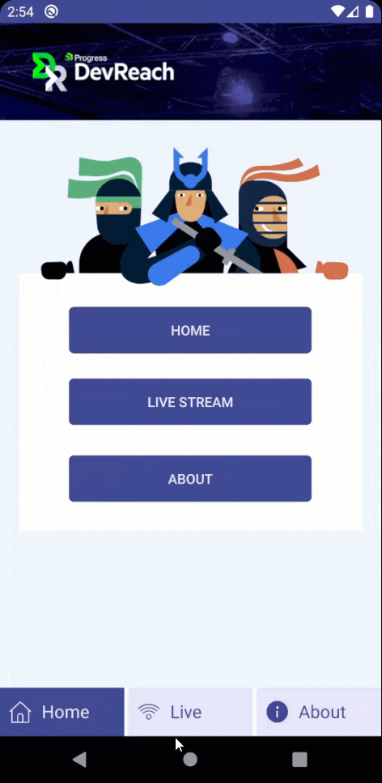
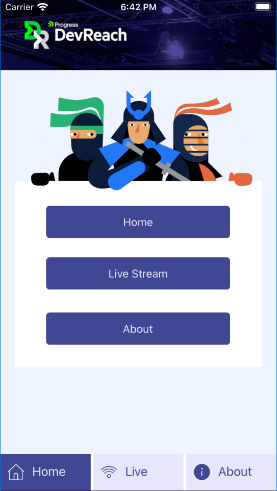
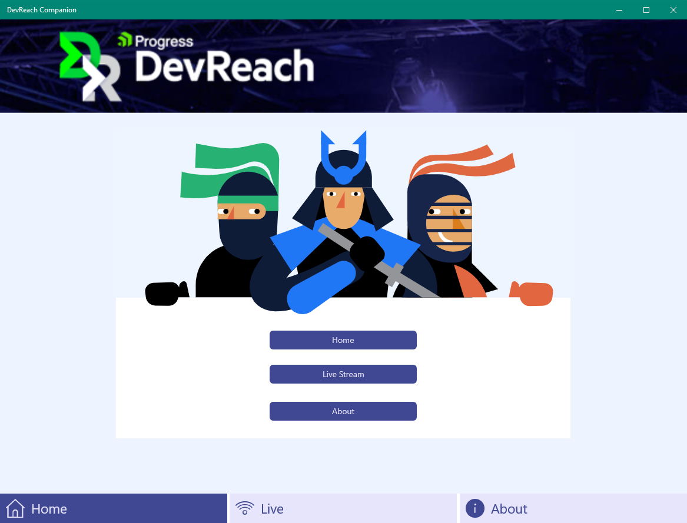

# Progress DevReach

This repository holds my projects for each DevReach conference. Nested inside src folder, you will find the relevant year, open that year and you'll also find the README with the details for that year's project.

* [**DevReach 2020 Projects**](https://github.com/LanceMcCarthy/DevReachCompanion/tree/main/src/DevReach2020)
* [**DevReach 2019 Projects**](https://github.com/LanceMcCarthy/DevReachCompanion/tree/main/src/DevReach2019)

# DevReach 2020

Demonstrating the use of the GitHub Actions CI-CD, find the workflows in `.github/workflows` folder.

## GitHub Actions

### Continuous Integration

| Default  | `main` branch | `v2020` branch |
|----------|------|----------|
| /badge.svg) | /badge.svg?branch=main) | /badge.svg?branch=v2020) |

### Continuous Deployment

| Workflow | Status |
|----------|--------|
| AppCenter       | /badge.svg) |
| iOS Release     | /badge.svg) |
| Android Release | /badge.svg) |
| Windows Release | /badge.svg) |

## AppCenter

**Builds**

| Platform | Preleases | Store |
|----------|----------------|-------------------|
| Android  |  |  |
| iOS  |  |  |
| UWP |   | n/a |

**Distributions**

| Platform   | Beta Installation | Production Installation |
|------------|-----------|------------|
| Android    |  [Install from AppCenter](install.appcenter.ms/users/lance-mccarthy-1uw5/apps/devreach-2020-android/distribution_groups/testers) |      |
| iOS        |  [Install from AppCenter](install.appcenter.ms/users/lance-mccarthy-1uw5/apps/devreach-2020-ios/distribution_groups/testers) |  |
| Windows | [Install from AppCenter](install.appcenter.ms/users/lance-mccarthy-1uw5/apps/devreach-2020-uwp/distribution_groups/testers) or  [**use AppInstaller** (*recommended*)](https://dvlup.blob.core.windows.net/general-app-files/Installers/DevReachCompanion/index.html) |  |

## Previews

| Android  | iOS                                      | Windows      |
|----------|------------------------------------------|----------|
|  |  |  |

## Project Summary

### DevReach 2020

For 2020, I am demonstrating the use of GitHub Actions CI-CD workflows! You will find the source code in [**src\DevReach2020**](https://github.com/LanceMcCarthy/DevReachCompanion/tree/main/src/DevReach2020) folder and see `.github/Workflows` folder for the workflows.

### DevReach 2019

In the [**src\DevReach2019**](https://github.com/LanceMcCarthy/DevReachCompanion/tree/main/src/DevReach2019) folder, you will find a **Xamarin.Forms** solution, with an **ASP.NET Core 3.1** project, all leveraging **Azure DevOps** to build and release all four applications.

You'll not only find links to the DevOps build and releases, but also links to the production applications in their respective app Stores.
